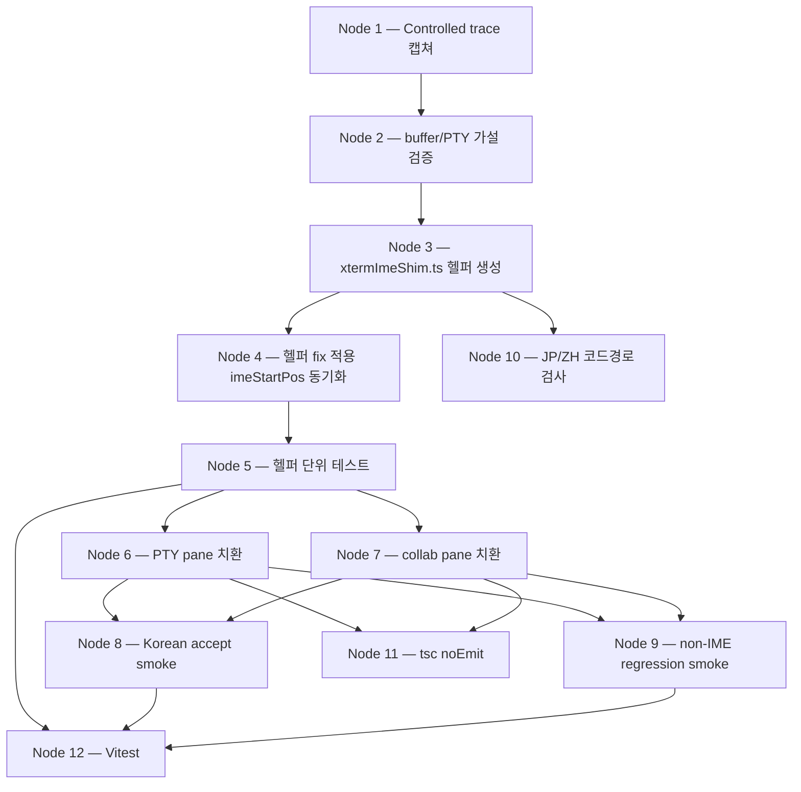

# Feature plan — korean-ime-dup-render

## Goal

Canvas Terminal 사용자가 한글 IME 입력 시, PTY 터미널 패널과 collaborator pane의 AI 에이전트 빌트인 미니터미널 양쪽 모두에서 입력 문자가 시각적 중복 없이, 화살표키 정리 없이 in-place로 렌더링되어야 한다.

## In scope

- xterm.js + PTY 파이프라인의 IME composition + 버퍼 렌더링 상호작용 진단/수정 (두 surface 각자의 커스텀 IME shim 포함)
- 두 surface(PTY 패널 + collaborator 미니터미널) 모두 커버 — 공유 헬퍼(`src/lib/xtermImeShim.ts`)로 추출하여 한 곳에서 fix
- v0.5.x 패치 릴리스 envelope 안에서 ship

## Out of scope

- 일본어/중국어 IME 기능 지원 (사용자 미사용; 별도 intent로 deferred — non-regression만 acceptance 게이트)
- non-macOS 플랫폼 (사용자 환경 외)
- xterm.js 메이저 버전 bump, IME/keystroke 핸들링 레이어의 광범위 아키텍처 리팩터

## Constraints

1. v0.5.x 패치로 ship — non-breaking API, bounded scope
2. non-IME 타이핑 지연/정확성 회귀 없음
3. render-only 가설은 implementer Node 2 경험적 검증 후 확정 — 빗나가면 escalate back to planner
4. xterm.js 메이저 bump 또는 IME 레이어 broad refactor 금지 (envelope 위반 시 intent 재오픈 escalate)
5. 두 surface 모두 cover — 한쪽만 land 금지 (helper 추출 + 두 호출 지점 치환으로 강제 동등 적용)

## Success criteria

1. PTY 패널에서 "안녕하세요"를 한 글자씩 타이핑 시 매 intermediate composition/commit 상태가 현재 한글 텍스트(committed + composing)를 정확히 1회만 렌더, 최종 syllable 이후 visible line이 화살표키 정리 없이 정확히 "안녕하세요"
2. Collaborator 미니터미널에서 동일 동작
3. 더 긴 구문("한국어 입력 테스트")도 양 surface에서 누적 duplicate 없이 정확히 1회 composition
4. ASCII, paste, 화살표키, Ctrl+C/R, Tab completion, shell history(↑/↓) 회귀 없음 (양 surface)
5. JP/ZH IME가 pre-fix baseline 대비 가시적으로 더 나빠지지 않음 — Korean fix가 건드린 코드 경로 한정 lightweight smoke

## Open questions

| OQ | 해소 | 핸들러 |
|---|---|---|
| OQ1 — Tahoe 26.5.1 falsification | low-priority diagnostic, post-fix optional | implementer 여유 시 git-bisect (acceptance 게이트 아님) |
| OQ2 — root cause | 가설 (c) Canvas Terminal 커스텀 shim의 `imeStartPos` 동기화 누락 (composition-commit 직후 다음 composition 시작 시) | implementer Node 2에서 경험적 검증 |
| OQ3 — render-only vs write-path | render-only 가설 (셸 echo + 오버레이 misposition) | implementer Node 2 `terminal.buffer.active` 덤프 + PTY 트랜스크립트 |
| OQ4 — JP/ZH smoke 깊이 | floor only — 코드 경로 검사 (Korean-only 정규식 `reKorean` 외 IME-언어 분기 없음) | implementer Node 10 grep + 리뷰 |
| OQ5 — lockstep vs shared-helper | shared-helper (Path B) — 200+ LOC near-identical 중복; narrow extraction은 envelope 안 | 본 plan에서 확정 (헬퍼 모듈 emit) |
| OQ6 — controlled keystroke trace | implementer Node 1 캡쳐 필수, 가설 검증 전 코드 변경 금지 | implementer Node 1 (acceptance 선행 조건) |

## Package layout

신규 패키지 없음. 기존 구조에 `src/lib/xtermImeShim.ts` 단일 모듈 추가 + 기존 두 파일의 IME 블록을 헬퍼 호출로 치환.

```
src/
├── lib/
│   ├── terminalManager.ts           ← (PTY) IME 블록 → attachKoreanImeShim 호출로 치환
│   ├── xtermImeShim.ts              ← NEW: 공통 IME shim (스켈레톤 emit 완료)
│   ├── xtermImeShim.test.ts         ← NEW: 헬퍼 단위 테스트 (implementer Node 5)
│   └── ... (unchanged)
└── components/
    └── collaborator/
        ├── AgentMiniTerminal.tsx    ← (mini) IME 블록 → attachKoreanImeShim 호출로 치환
        └── ... (unchanged)
```

의존성 방향: `components/terminal/useTerminal.ts → lib/terminalManager.ts → lib/xtermImeShim.ts ← components/collaborator/AgentMiniTerminal.tsx`. `lib/`는 `components/`에 비의존(컨벤션 유지). 신규 모듈은 `@xterm/xterm` + `@tauri-apps/api`에만 의존, React 비의존(테스트 용이성).

## Decomposition

| Node # | Stage | Belongs to | Notes |
|---|---|---|---|
| 1 | Controlled keystroke trace 캡쳐 | implementer notes | "안녕하세요" + "한국어 입력 테스트" 풀 스트링, 각 step별 visible buffer + cursorX/Y + textarea.value + overlay text, 양 surface |
| 2 | 버퍼/PTY 가설 검증 | implementer notes | `terminal.buffer.active` 덤프 mid-composition + PTY 트랜스크립트로 render-only vs write-path 결정 — 빗나가면 escalate |
| 3 | `xtermImeShim.ts` 헬퍼 생성 | src/lib | overlay state, cursor hijack, isFullWidth, showOverlay, clearOverlay, onCompositionEnd, onTextareaBlur, docInput, docKeyDown, triggerDataEvent 패치, helperTextarea preventScroll 패치 — 단일 export `attachKoreanImeShim` |
| 4 | 헬퍼 fix 적용 | src/lib | `onCompositionEnd`에 `imeStartPos = textarea.value.length` (또는 `isComposing = false`) 추가 — Node 2 결과로 정확한 변형 결정 |
| 5 | 헬퍼 단위 테스트 | src/lib | WKWebView 시뮬레이션 fixture로 commit-boundary 시나리오 검증 (vitest) |
| 6 | PTY pane 치환 | src/lib | `terminalManager.ts:346–697` IME 블록을 `attachKoreanImeShim` 호출로 치환, `managed.imeHandlers/rebindIme/docKeyDown/docInput/imeOverlayEl` 라이프사이클은 handle로 wrap |
| 7 | collab pane 치환 | src/components/collaborator | `AgentMiniTerminal.tsx:448–699` IME 블록을 `attachKoreanImeShim` 호출로 치환, `imeOverlayRef/docInputRef/docKeyDownRef/imeHandlersRef` cleanup을 handle.dispose로 일원화 |
| 8 | Korean accept smoke | acceptance | 양 surface "안녕하세요" / "한국어 입력 테스트" 매 step 정확 1회 렌더, 화살표키 정리 불필요 |
| 9 | non-IME regression smoke | acceptance | ASCII, paste, 화살표키, Ctrl+C/R, Tab, shell history(↑/↓), Shift+Enter (CSI u), Cmd 단축키 양 surface |
| 10 | JP/ZH 코드 경로 검사 (OQ4 floor) | acceptance | `xtermImeShim.ts`에 `reKorean` 외 IME-언어 분기 없음 grep 확인 |
| 11 | TypeScript 컴파일 | validation | `tsc --noEmit` 통과 |
| 12 | Vitest | validation | 기존 + 헬퍼 단위 테스트 통과 |

### Decomposition DAG



Interface-level DAG는 `plan.mmd` 참고 (단일 노드 `attachKoreanImeShim`).

## Interfaces emitted

| 이름 | 종류 | 파일 | 메서드 수 | 9-field docstring |
|---|---|---|---|---|
| `attachKoreanImeShim` | 자유 함수 (export `declare function`) | `src/lib/xtermImeShim.ts` | 1 | ✓ (Responsibility, Pipeline-position, Inputs, Outputs, Side-effects, Preconditions, Postconditions, Failure-modes, Collaborators) |

부속 value-object (`.planner-state.json::value_objects`):

| 이름 | 종류 | 파일 |
|---|---|---|
| `AttachKoreanImeShimOptions` | TS `interface` | `src/lib/xtermImeShim.ts` |
| `KoreanImeShimHandle` | TS `interface` | `src/lib/xtermImeShim.ts` |

스켈레톤 커밋: `7f4675b`. 본문 없음 (`export declare function ...`); implementer Phase가 `declare` 제거 후 본문 채움.

## Validation

| 단계 | 명령 | 결과 |
|---|---|---|
| Phase 6 컴파일 검사 | `tsc --noEmit` (워크트리 루트) | passed (exit 0) |
| Phase 7 smoke check | `plan.md` headers + `plan.mmd` Mermaid parse | passed (이 커밋 발행 시 실행) |

## Rubric

skeleton 발행 모드 → 시스템 lane 6-criterion 적용.

| 기준 | 점수 (0–4) | 근거 |
|---|---|---|
| Decomposition completeness | 4 | 12 노드가 Phase 1의 모든 success criterion + OQ를 cover (Node 1·2: OQ3·6 검증, Node 3·4: OQ2·5, Node 6·7: 양 surface, Node 8·9·10: 5개 acceptance, Node 11·12: 검증) |
| Dependency direction | 4 | helper(`src/lib`)는 `components/`에 비의존; 호출자 둘 모두 `src/lib` 또는 `src/components`에서 단방향 임포트 — 사이클 없음 |
| Validation status | 4 | `tsc --noEmit` clean; skeleton + 두 콜사이트가 동일 시그니처로 검증 가능 |
| Plan coverage | 3 | 6 OQ 중 5개 해소(2개는 implementer 검증 게이트), envelope 외 회귀 가능성은 Constraint #3 escalation 경로 명시 |
| Docstring quality | 4 | 9-field 전부 채움, 타입 재진술 없음, Failure-modes 비어있지 않음, Collaborators 외부 협력자만 |
| Interface cohesion | 4 | 단일 export 함수 + 2개 value-object — 응집도 최대, helper 모듈 1개로 두 호출 지점 정확히 커버 |

## Human-confirmation checklist

- [ ] OQ2/OQ3 가설("imeStartPos 동기화 누락, render-only")이 합리적이라고 판단
- [ ] Path B(shared-helper) 선택이 v0.5.x 패치 envelope 안에 있다고 판단
- [ ] Node 1·2가 acceptance의 진정한 선행 조건이라고 판단 (가설이 빗나가면 planner escalate)
- [ ] 신규 `src/lib/xtermImeShim.ts` 단일 모듈 추가가 받아들일 만한 표면 변화라고 판단
- [ ] Node 5(헬퍼 단위 테스트) 범위가 충분하다고 판단 (WKWebView fixture 시뮬레이션)
- [ ] Node 9(non-IME 회귀 smoke)가 양 surface에서 5개 영역(ASCII/paste/hotkey/history/Shift+Enter)을 모두 cover한다고 판단
- [ ] JP/ZH smoke가 코드 경로 검사(floor)로 충분하다고 판단 (ceiling=수동 IME 설치는 implementer 선택)
- [ ] 본 plan이 implementer에 대한 충분한 사양이라고 판단

## Provenance

- Intent slug: `korean-ime-dup-render`
- Upstream plan-establisher: `plan.korean-ime-dup-render.v3.md` (merged on `dev` @ `4cdc339`, marker `(plan, human-confirmed)`)
- Planner ID: `18137-24973-29882`
- Planner worktree: `.worktrees/planner-korean-ime-dup-render-18137-24973-29882`
- Planner branch: `planner/korean-ime-dup-render-18137-24973-29882` (from `dev`)
- Skeleton commit: `7f4675b`
- Downstream handoff scope: input to `/codebase-implementer`; Phase 8 merge will emit `(plan-feature, human-confirmed)`.
