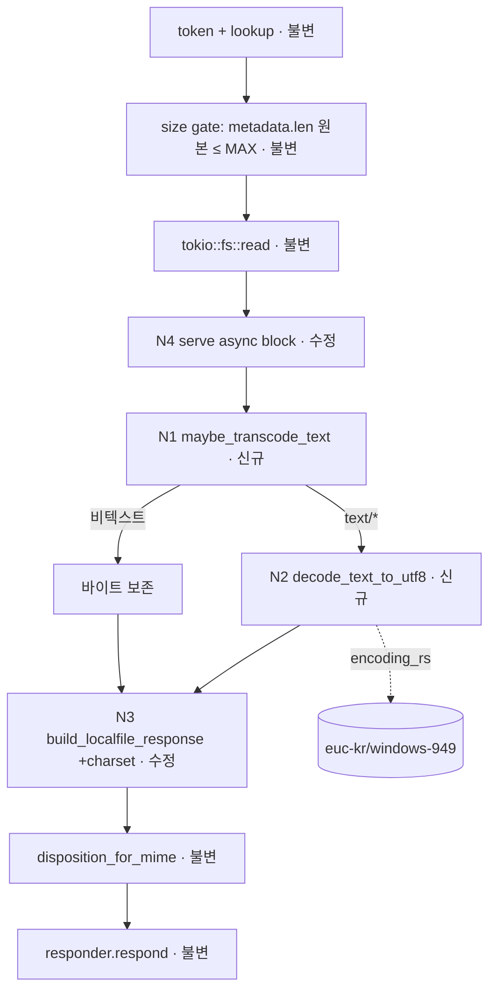

# Plan — browser-korean-text (feature lane)

> Source intent: `intent.browser-korean-text.md` (merged `(intent, human-confirmed)`, 2-round peer-reviewed).
> Scale: **feature** (scope 2, risk 2, ambiguity 1 → final 2). Stack: **Rust** (`src-tauri`).
> Planner ID: 48726-41263-1735. No interface skeletons (internal function changes, no new cross-boundary contract).

## 1. Goal

내장 브라우저가 `localfile://`로 로컬 텍스트 파일을 인라인 렌더할 때, 한글이 **UTF-8 및 한국어 레거시(EUC-KR/CP949)** 범위에서 깨짐 없이 표시되도록 한다.

## 2. Root cause (확정)

`localfile.rs`의 서빙 경로는 `classify_mime`(확장자 기반, charset 없음)가 만든 `text/plain`을 `Content-Type`에 그대로 싣고 **raw 바이트**를 `X-Content-Type-Options: nosniff`와 함께 전달한다. 실제 깨진 샘플(`어린왕자-dmsah10.txt`)은 **CP949**이므로, charset 신호도 트랜스코딩도 없는 상태에서 WebKit가 불일치 인코딩으로 해석 → mojibake. `; charset=utf-8`만 붙이는 것으로는 CP949 파일을 고칠 수 없다(바이트 자체가 UTF-8이 아님).

## 3. Resolved strategy (인텐트 open questions 확정)

| 결정 항목 | 확정안 | 근거 |
|---|---|---|
| 전략 | **서버측 트랜스코딩**: text/* 바디를 UTF-8로 변환 후 `; charset=utf-8` 부여 | 커스텀 스킴에서 WebKit의 레거시 charset 준수에 의존하지 않아 결정론적. `dashboard/server.rs` 선례와 일관 |
| 감지 순서 | **strict UTF-8 우선 → 실패 시 CP949(EUC-KR)** | UTF-8 자기검증성으로 오판 위험 최소. 비한국어 레거시 미감지는 범위상 수용 |
| 적용 클래스 | **`text/*` 에만** 트랜스코딩+charset. 이미지/PDF/octet-stream은 바이트 보존 | 회귀 금지(비텍스트 attachment/inline 동작 불변) |
| MAX_BYTES | **원본 read-전 게이트 유지**(localfile.rs:566). 트랜스코딩은 메모리 내 ≤~1.5x | 256MiB 텍스트는 비현실적. Content-Length는 트랜스코딩된 `bytes.len()`로 자연 정확 |
| 의존성 | **`encoding_rs`만** 추가 (chardetng 불필요) | 일반 charset 추정을 하지 않음. WHATWG `euc-kr`/`windows-949` 디코더 제공, Firefox 인코딩 엔진 |

## 4. Pipeline decomposition



(canonical machine-readable DAG: `plan.mmd`.)

## 5. Node-by-node implementation notes

> 시그니처는 제안이며 구현자가 Rust 관용에 맞게 미세 조정 가능. 단, charset/클래스-게이팅/Content-Length 불변식은 유지할 것.

### N2 — `decode_text_to_utf8` (신규, private fn in `localfile.rs`)
- **목적:** 텍스트 바이트를 UTF-8 `String`으로 디코드.
- **동작:**
  1. `std::str::from_utf8(bytes)` 성공 → 그대로 소유 `String`으로 반환 (UTF-8 BOM `EF BB BF` 접두는 valid UTF-8이라 통과 — 브라우저가 처리; v1은 별도 BOM 스트립 안 함).
  2. 실패 → `encoding_rs::EUC_KR.decode(bytes)` → `(Cow<str>, _, _had_errors)`의 문자열 반환. (`EUC_KR`은 windows-949/CP949 상위집합.)
- **시그니처(제안):** `fn decode_text_to_utf8(bytes: &[u8]) -> String`
- **호출 조건:** text/* 일 때만 (N1 경유).

### N1 — `maybe_transcode_text` (신규, private fn)
- **목적:** MIME 클래스 게이팅 + 트랜스코딩 분기.
- **동작:** `mime.starts_with("text/")` → `decode_text_to_utf8(&bytes).into_bytes()` 반환; 아니면 `bytes` 원본 그대로 반환(바이트 보존).
- **시그니처(제안):** `fn maybe_transcode_text(bytes: Vec<u8>, mime: &str) -> Vec<u8>`

### N3 — `build_localfile_response` (수정, localfile.rs:265)
- **변경점:** `Content-Type` 헤더 값을, `mime.starts_with("text/")`이면 `format!("{mime}; charset=utf-8")`, 아니면 `mime` 그대로 사용.
- **불변 유지:** Content-Length=`bytes.len()`(트랜스코딩된 버퍼), CSP, `nosniff`, Referrer-Policy, `disposition_for_mime`. charset은 상수 리터럴이라 CR/LF 주입 없음.
- **docstring:** Content-Type postcondition을 `text/*` → `; charset=utf-8` 포함하도록 갱신.

### N4 — serving async block (수정, localfile.rs:556–581)
- **변경점:** `let bytes = tokio::fs::read(...)` 직후, `build_localfile_response` 호출 전에:
  ```rust
  let bytes = maybe_transcode_text(bytes, &mime);
  let response = build_localfile_response(bytes, &mime, &canonical_path);
  ```
- **불변 유지:** size gate(566)는 원본 `metadata.len()` 기준 그대로. 에러 경로(404/413/500) 불변.

### Cargo.toml (수정)
- `encoding_rs = "<최신 안정>"` 추가 (구체 버전은 구현자가 lock; **하드코딩 버전 금지** 규칙은 plan 문서엔 무방하나 구현 시 워크스페이스 관례 따름).

## 6. Validation & test plan

**컴파일/타입:** `cargo check` (워크트리에선 스켈레톤이 없어 Phase 6는 헤더+Mermaid 스모크; 실제 컴파일 검증은 구현자 Phase에서).

**단위 테스트** (`#[cfg(test)]` in `localfile.rs`, **커밋된 인라인 바이트 벡터** — `~/Downloads` 의존 금지):
- `decode_text_to_utf8`:
  - CP949 `[0xbf,0xa9,0xbc,0xb8]` → `"여섯"` (샘플 도입부 바이트)
  - 유효 UTF-8 `"안녕".as_bytes()` → `"안녕"` (통과)
  - ASCII `b"hello"` → `"hello"`
- `maybe_transcode_text`:
  - `("text/plain", CP949 bytes)` → UTF-8 바이트로 변환됨
  - `("image/png", &[0x89,0x50,0x4e,0x47,...])` → **바이트 동일**(보존)
- `build_localfile_response`:
  - `text/plain` → `Content-Type: text/plain; charset=utf-8`, `Content-Length == bytes.len()`
  - `image/png` → `Content-Type: image/png` (charset 없음)
  - 기존 보안 헤더(CSP/nosniff/referrer) 존재 유지

**비회귀:** 기존 `disposition_for_mime` 테스트(인라인 클래스/control-char sanitize) 불변. ASCII/영문 텍스트, 이미지/PDF, attachment 동작 변화 없음.

**수동 검증:** `어린왕자-dmsah10.txt`(CP949)를 내장 브라우저로 열어 "여섯 살 적에 나는 「체험한 이야기」…" 정상 표시 확인; UTF-8 한글 `.txt`/`.md`도 정상.

## 7. Risks & mitigations

- **신규 의존성(`encoding_rs`)** — 빌드 시간 소폭 증가. 완화: 광범위 사용/검증된 crate.
- **text/* 확장자를 가진 바이너리** — 디코드 시 치환문자 발생 가능. 범위상 수용(확장자 기반; 바이너리 위장 감지는 out-of-scope).
- **CP949 의도였으나 우연히 valid UTF-8인 파일** — UTF-8로 유지(정상; valid UTF-8은 모호하지 않음).
- **MAX_BYTES ~1.5x 팽창** — 256MiB 경계 텍스트에서만 이론적 초과. v1 수용, 필요 시 post-transcode 체크는 후속.

## 8. Out-of-scope (구현자 금지)

터미널/캔버스/협업 패널, 원격 http(s) charset, 한국어 외 인코딩(UTF-16/32·Shift_JIS·GBK·Big5), 에디터 변환 기능, attachment→inline 동작 변경, 보안 헤더/토큰/deny-prefix/URL-scheme 3-way invariant 변경.

## 9. Self-verification (feature lane rubric, 4×4)

| 기준 | 점수(4) | 비고 |
|---|---|---|
| 목표 정합성 (intent↔plan) | 4 | goal/scope/success 모두 추적 |
| 분해 완전성 (E2E 노드 누락 없음) | 4 | read→transcode→build→respond 전 구간 |
| 제약/불변식 보존 | 4 | 보안 헤더·MAX_BYTES·Content-Length·클래스 게이팅 명시 |
| 검증 가능성 (테스트/수동) | 4 | 인라인 바이트 fixture + 수동 시나리오 |

(스켈레톤 미발행 → "Docstring quality"/"Interface cohesion" 기준 제외.)
