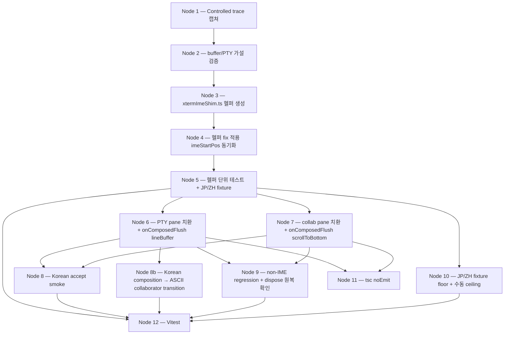

# Feature plan — korean-ime-dup-render

## Goal

Canvas Terminal 사용자가 한글 IME 입력 시, PTY 터미널 패널과 collaborator pane의 AI 에이전트 빌트인 미니터미널 양쪽 모두에서 입력 문자가 시각적 중복 없이, 화살표키 정리 없이 in-place로 렌더링되어야 한다.

## In scope

- xterm.js + PTY 파이프라인의 IME composition + 버퍼 렌더링 상호작용 진단/수정 (두 surface 각자의 커스텀 IME shim 포함)
- 두 surface(PTY 패널 + collaborator 미니터미널) 모두 커버 — 공유 헬퍼(`src/lib/xtermImeShim.ts`)로 추출하여 한 곳에서 fix
- v0.5.x 패치 릴리스 envelope 안에서 ship

## Out of scope

- 일본어/중국어 IME 기능 지원 (사용자 미사용; 별도 intent로 deferred — non-regression만 acceptance 게이트)
- non-macOS 플랫폼 (사용자 환경 외)
- xterm.js 메이저 버전 bump, IME/keystroke 핸들링 레이어의 광범위 아키텍처 리팩터

## Constraints

1. v0.5.x 패치로 ship — non-breaking API, bounded scope
2. non-IME 타이핑 지연/정확성 회귀 없음
3. render-only 가설은 implementer Node 2 경험적 검증 후 확정 — 빗나가면 escalate back to planner
4. xterm.js 메이저 bump 또는 IME 레이어 broad refactor 금지 (envelope 위반 시 intent 재오픈 escalate)
5. 두 surface 모두 cover — 한쪽만 land 금지 (helper 추출 + 두 호출 지점 치환으로 강제 동등 적용)

## Success criteria

1. PTY 패널에서 "안녕하세요"를 한 글자씩 타이핑 시 매 intermediate composition/commit 상태가 현재 한글 텍스트(committed + composing)를 정확히 1회만 렌더, 최종 syllable 이후 visible line이 화살표키 정리 없이 정확히 "안녕하세요"
2. Collaborator 미니터미널에서 동일 동작
3. 더 긴 구문("한국어 입력 테스트")도 양 surface에서 누적 duplicate 없이 정확히 1회 composition
4. ASCII, paste, 화살표키, Ctrl+C/R, Tab completion, shell history(↑/↓) 회귀 없음 (양 surface)
5. JP/ZH IME 공유 상태 머신 경로가 Node 5/10 fixture floor(비한글 `keydown(229)` + `insertReplacementText/insertText` + `compositionend` 시퀀스 → 중복 flush 없음 / drop 없음 / overlay 1회 렌더)를 통과; 수동 JP IME 가시적 smoke는 implementer 가용 시 ceiling, 미가용 시 잔존 위험을 implementation-report에 명시 (round-2 peer fold: codex1 Low — success criterion이 새 fixture 기반 게이트와 일치)

## Open questions

| OQ | 해소 | 핸들러 |
|---|---|---|
| OQ1 — Tahoe 26.5.1 falsification | low-priority diagnostic, post-fix optional | implementer 여유 시 git-bisect (acceptance 게이트 아님) |
| OQ2 — root cause | 가설 (c) Canvas Terminal 커스텀 shim의 `imeStartPos` 동기화 누락 (composition-commit 직후 다음 composition 시작 시) | implementer Node 2에서 경험적 검증 |
| OQ3 — render-only vs write-path | render-only 가설 (셸 echo + 오버레이 misposition) | implementer Node 2 `terminal.buffer.active` 덤프 + PTY 트랜스크립트 |
| OQ4 — JP/ZH smoke 깊이 | **fixture floor**: Node 5 단위 fixture가 비한글 IME-like 시퀀스(`keydown(229)` + `inputType=insertReplacementText/insertText` + `compositionend`)를 헬퍼에 통과시켜 상태 머신 무회귀(중복 flush 없음, drop 없음) 검증 — 단순 grep을 fixture-기반으로 격상 (round-1 peer fold: codex2 F1, codex3 Medium #1). Ceiling: 수동 JP IME 설치 smoke는 implementer 선택. IME 미설치 환경에서는 JP/ZH 잔존 위험을 명시적으로 수용. | implementer Node 10 (fixture) + Node 5 (단위) |
| OQ5 — lockstep vs shared-helper | shared-helper (Path B) — 200+ LOC near-identical 중복; narrow extraction은 envelope 안 | 본 plan에서 확정 (헬퍼 모듈 emit) |
| OQ6 — controlled keystroke trace | implementer Node 1 캡쳐 필수, 가설 검증 전 코드 변경 금지 | implementer Node 1 (acceptance 선행 조건) |

## Package layout

신규 패키지 없음. 기존 구조에 `src/lib/xtermImeShim.ts` 단일 모듈 추가 + 기존 두 파일의 IME 블록을 헬퍼 호출로 치환.

```
src/
├── lib/
│   ├── terminalManager.ts           ← (PTY) IME 블록 → attachKoreanImeShim 호출로 치환
│   ├── xtermImeShim.ts              ← NEW: 공통 IME shim (스켈레톤 emit 완료)
│   ├── xtermImeShim.test.ts         ← NEW: 헬퍼 단위 테스트 (implementer Node 5)
│   └── ... (unchanged)
└── components/
    └── collaborator/
        ├── AgentMiniTerminal.tsx    ← (mini) IME 블록 → attachKoreanImeShim 호출로 치환
        └── ... (unchanged)
```

의존성 방향: `components/terminal/useTerminal.ts → lib/terminalManager.ts → lib/xtermImeShim.ts ← components/collaborator/AgentMiniTerminal.tsx`. `lib/`는 `components/`에 비의존(컨벤션 유지). 신규 모듈은 `@xterm/xterm` + `@tauri-apps/api`에만 의존, React 비의존(테스트 용이성).

## Decomposition

| Node # | Stage | Belongs to | Notes |
|---|---|---|---|
| 1 | Controlled keystroke trace 캡쳐 | implementer notes | "안녕하세요" + "한국어 입력 테스트" 풀 스트링, 각 step별 visible buffer + cursorX/Y + textarea.value + overlay text, 양 surface |
| 2 | 버퍼/PTY 가설 검증 | implementer notes | `terminal.buffer.active` 덤프 mid-composition + PTY 트랜스크립트로 render-only vs write-path 결정 — 빗나가면 escalate |
| 3 | `xtermImeShim.ts` 헬퍼 생성 | src/lib | overlay state, cursor hijack, isFullWidth, showOverlay, clearOverlay, onCompositionEnd, onTextareaBlur, docInput, docKeyDown, triggerDataEvent 패치, helperTextarea preventScroll 패치 — 단일 export `attachKoreanImeShim`. **20ms `triggerDataEvent` deferral**은 기존 inline shim에서 carry-over; 본문에 `// FIXME: 20ms empirically tuned for WKWebView on macOS; revalidate on major macOS bumps` 주석 추가 (round-1 peer fold: claude3 N4) |
| 4 | 헬퍼 fix 적용 | src/lib | **선호 변형: (b) `isComposing = false` in `onCompositionEnd`** — 기존 `keydown(229)` 분기의 `imeStartPos = (textarea.value.length ?? 1) - 1` 재설정 로직을 자연스럽게 활용. `- 1`은 WKWebView의 `input`-before-`keydown` 순서 때문 — keydown(229) 시점에서 `textarea.value`는 이미 방금 누른 자모를 포함하므로 1 빼서 composition 시작점을 정확히 가리킴 (round-2 peer fold: claude2 C2). (a) `imeStartPos = textarea.value.length` 직접 설정은 Node 2 trace가 (b)를 falsify할 때만 — **trace 시 falsification 케이스 명시 포함**: 한글 syllable 후 (i) 화살표키, (ii) IME 끄고 ASCII 입력, (iii) Esc/Tab 등 non-IME 키 → `imeStartPos` 잔존이 다음 텍스트 슬라이스를 mis-position하는지 확인 (round-2 peer fold: claude3 R2-N1). 변형 (b) 채택 시 Node 5/8가 final-syllable + 다음 키 없는 경우의 overlay/cursor lifecycle도 검증 (round-2 peer fold: codex3 non-blocking note). |
| 5 | 헬퍼 단위 테스트 | src/lib | **범위 = 헬퍼 상태 머신 substate 검증** (jsdom + 합성 이벤트 — WKWebView의 `input`-before-`keydown` 순서 명시); commit-boundary 시나리오 (Korean) + 비한글 IME-like 시퀀스(OQ4 fixture floor). 실제 WKWebView 동작 smoke는 Node 8/8b가 acceptance 게이트 (round-1 peer fold: claude3 N3, claude2 I5) |
| 6 | PTY pane 치환 | src/lib | `terminalManager.ts:346–672` IME 블록을 `attachKoreanImeShim` 호출로 치환 (line range 정정: 673–698은 `terminal.onData` 콜백으로, IME가 아님 — round-1 peer fold: claude2 I2). `managed.imeHandlers/rebindIme/docKeyDown/docInput/imeOverlayEl` 라이프사이클은 `handle.dispose()`로 **일원화** (병행 manual cleanup 금지 — round-1 peer fold: codex1 High). **`terminal.onData` 콜백은 그대로 유지**하되 lineBuffer `collaborator` 감지를 `onComposedFlush(committedText, terminator)` 콜백으로도 동기화 — 한글 음절 commit (compositionend/blur/terminator-flush) 직후 lineBuffer가 갱신되어야 "collaborator\r" 입력 시 spawn 누락 없음 (round-1 peer fold: claude3 C1, claude2 I2, codex1·codex2 callback contract). **Font-size 변형 경로**: `ensureGlobalSubscriptions`의 `s.imeOverlayEl.style.fontSize = ${state.fontSize}px` (terminalManager.ts:122-123) → `handle.overlayEl?.style.fontSize`로 치환 (round-1 peer fold: claude2 I3, codex1 Medium) |
| 7 | collab pane 치환 | src/components/collaborator | `AgentMiniTerminal.tsx:448–699` IME 블록을 `attachKoreanImeShim` 호출로 치환, `imeOverlayRef/docInputRef/docKeyDownRef/imeHandlersRef` cleanup을 `handle.dispose()`로 일원화. **`onComposedFlush` 구독**: 콜백 내에서 `terminal.scrollToBottom()` 호출 — Korean compose가 `terminal.onData` (AgentMiniTerminal.tsx:702-710)를 우회하여 발생하는 scroll-snap 누락을 닫음 (round-1 peer fold: codex3 Medium #2). **Font-size 변형 경로**: 기존 font-size effect의 `imeOverlayRef.current.style.fontSize = ${newSize}px` (AgentMiniTerminal.tsx:914-915) → `handle.overlayEl?.style.fontSize`로 치환 (round-1 peer fold: claude2 I3, codex1 Medium) |
| 8 | Korean accept smoke | acceptance | 양 surface "안녕하세요" / "한국어 입력 테스트" 매 step 정확 1회 렌더, 화살표키 정리 불필요 |
| 8b | **Korean composition → ASCII `collaborator` keyword transition acceptance** | acceptance | **NEW (round-1 peer fold: claude3 C1)**, heading 정정 (round-2 peer fold: codex1 Low, claude2 C3 — ASCII 키워드가 Hangul-composed라는 오해 방지; 본질은 `onComposedFlush` lineBuffer 동기화 검증). **Sub-cases (둘 다 통과)**: (i) 한글(예: `안녕`) 입력 후 IME 끄고 `collaborator\r` 입력 → spawn 트리거 (lineBuffer가 commit/blur/terminator-flush를 통해 한글을 거쳐 ASCII `collaborator`만 보유); (ii) 한글 없이 baseline ASCII `collaborator\r` → 기존 동작 회귀 없음. (iii) 중간 혼합(`안collaborator\r`)은 본 acceptance 범위 외. |
| 9 | non-IME regression smoke | acceptance | ASCII, paste, 화살표키, Ctrl+C/R, Tab, shell history(↑/↓), Shift+Enter (CSI u), Cmd 단축키 양 surface. **추가**: `handle.dispose()` 호출 후 ① `triggerDataEvent` 원복, ② `isCursorHidden` property descriptor 원복, ③ document-level listeners 제거, ④ helperTextarea `focus` 패치 원복, ⑤ overlay DOM 제거 확인 — React StrictMode remount + terminal reparenting 시나리오 포함 (round-1 peer fold: codex1 High, codex3 Low #3) |
| 10 | **JP/ZH non-regression fixture (OQ4)** | acceptance + src/lib | **격상 (round-1 peer fold: codex2 F1, codex3 Medium #1)**. (a) `xtermImeShim.ts`에 `reKorean` 외 IME-언어 분기 없음 grep (floor 보존) **+** (b) Node 5 fixture가 비한글 `keydown(229)` + `inputType=insertReplacementText` + `compositionend` 시퀀스를 헬퍼에 통과시켜 ① 중복 flush 없음, ② drop 없음, ③ 오버레이 1회 렌더 검증. 수동 JP IME smoke (ceiling)는 implementer 가용 시 1회. **Ceiling 미실행 시 `implementation-report.md`에 `JP/ZH manual smoke: skipped — JP IME not installed` 명시 (downstream 회귀 보고 시 상관관계 추적용 — round-2 peer fold: claude3 R2-N3).** |
| 11 | TypeScript 컴파일 | validation | `tsc --noEmit` 통과 |
| 12 | Vitest | validation | 기존 + 헬퍼 단위 테스트 통과 (Node 5 fixture + JP/ZH 시퀀스 포함) |

### Decomposition DAG



**plan.mmd 메모**: `plan.mmd`는 interface-level (skill의 `render_mermaid_dag.py`가 `.planner-state.json::interfaces`를 렌더 — 단일 노드 `attachKoreanImeShim`). 13-node (Node 8b 포함) decomposition DAG는 본 plan.md::Decomposition DAG 임베디드 Mermaid 블록이 권위본 (round-1 peer fold: codex1 Low, claude2 I6; round-2 peer fold: codex1 Low — node count 정정 12→13).

## Interfaces emitted

| 이름 | 종류 | 파일 | 메서드 수 | 9-field docstring |
|---|---|---|---|---|
| `attachKoreanImeShim` | 자유 함수 (export `declare function`) | `src/lib/xtermImeShim.ts` | 1 | ✓ (Responsibility, Pipeline-position, Inputs, Outputs, Side-effects, Preconditions, Postconditions, Failure-modes, Collaborators) |

부속 value-object (`.planner-state.json::value_objects`):

| 이름 | 종류 | 파일 |
|---|---|---|
| `AttachKoreanImeShimOptions` | TS `interface` | `src/lib/xtermImeShim.ts` |
| `KoreanImeShimHandle` | TS `interface` | `src/lib/xtermImeShim.ts` |

스켈레톤 커밋: `7f4675b`. 본문 없음 (`export declare function ...`); implementer Phase가 `declare` 제거 후 본문 채움.

## Validation

| 단계 | 명령 | 결과 |
|---|---|---|
| Phase 6 컴파일 검사 | `tsc --noEmit` (워크트리 루트) | passed (exit 0) |
| Phase 7 smoke check | `plan.md` headers + `plan.mmd` Mermaid parse | passed (이 커밋 발행 시 실행) |

## Rubric

skeleton-emission rubric (6 criterion) — feature 레인에서 skeleton emit 시 적용 (system 레인 재분류 아님 — round-1 peer fold: claude3 rubric audit, codex3 Low rename).

| 기준 | 점수 (0–4) | 근거 |
|---|---|---|
| Decomposition completeness | 4 | 13 노드(Node 8b 포함)가 Phase 1의 모든 success criterion + OQ를 cover (Node 1·2: OQ3·6 검증, Node 3·4: OQ2·5, Node 6·7: 양 surface, Node 8·8b·9·10: acceptance, Node 11·12: 검증) |
| Dependency direction | 4 | helper(`src/lib`)는 `components/`에 비의존; 호출자 둘 모두 `src/lib` 또는 `src/components`에서 단방향 임포트 — 사이클 없음 |
| Validation status | 4 | `tsc --noEmit` clean; skeleton + 두 콜사이트가 동일 시그니처로 검증 가능 |
| Plan coverage | 3 | 6 OQ 중 5개 해소(2개는 implementer 검증 게이트), envelope 외 회귀 가능성은 Constraint #3 escalation 경로 명시 |
| Docstring quality | 4 | 9-field 전부 채움, 타입 재진술 없음, Failure-modes 비어있지 않음, Collaborators 외부 협력자만 |
| Interface cohesion | 4 | 단일 export 함수 + 2개 value-object — 응집도 최대, helper 모듈 1개로 두 호출 지점 정확히 커버 |

## Human-confirmation checklist

- [ ] OQ2/OQ3 가설("imeStartPos 동기화 누락, render-only")이 합리적이라고 판단
- [ ] Path B(shared-helper) 선택이 v0.5.x 패치 envelope 안에 있다고 판단
- [ ] Node 1·2가 acceptance의 진정한 선행 조건이라고 판단 (가설 빗나가면 planner escalate)
- [ ] 신규 `src/lib/xtermImeShim.ts` 단일 모듈 추가가 받아들일 만한 표면 변화라고 판단
- [ ] Node 5(헬퍼 단위 테스트) 범위가 충분 — 상태 머신 substate 검증 + 비한글 IME-like fixture(OQ4 floor); live WKWebView 동작은 Node 8/8b acceptance 게이트
- [ ] **Node 8b** (한글 IME로 `collaborator` 키워드 입력 → spawn 트리거) acceptance가 충분 — `onComposedFlush` lineBuffer 동기화 검증 (round-1 peer fold: claude3 C1)
- [ ] Node 9(non-IME 회귀 + `dispose()` 원복 확인)가 양 surface × 5개 영역(ASCII/paste/hotkey/history/Shift+Enter) + dispose 영역 모두 cover — **TSDoc `KoreanImeShimHandle.dispose()`의 restoration 항목 전체가 authoritative**(doc keydown/input listeners, triggerDataEvent reference, isCursorHidden property descriptor, overlay DOM, terminal.options 변형, compositionend/blur/focus listeners, helperTextarea.focus unpatch — round-2 peer fold: claude3 R2-N2)
- [ ] **JP/ZH 비회귀**: Node 10 fixture floor(비한글 keydown(229)+insertText+compositionend 시퀀스 통과)가 충분 — 수동 JP IME smoke ceiling은 implementer 가용 시, 미가용 시 implementation-report에 명시
- [ ] **`webgl?` 옵션**: skeleton에 committed된 signature 유지 (implementer가 제거 불가 — body-generation only 규칙). 두 호출 지점은 각자 자기 값(PTY=`true`, mini=`false`)을 전달; 헬퍼 내부에서 현재는 미사용, future renderer-asymmetric tweaks(cursor bar color / overlay z-index against WebGL canvas)를 위해 contract에 보존 (round-2 peer fold: claude2 C1, codex3 Medium, codex2 Note — 3/5 수렴; signature drop은 planner re-open 사항)
- [ ] **stale `implementation-report.md`** 제거 chore commit 동의 (mini-term-column-floor 잔존, git 히스토리 보존)
- [ ] 본 plan이 implementer에 대한 충분한 사양이라고 판단

## Provenance

- Intent slug: `korean-ime-dup-render`
- Upstream plan-establisher: `plan.korean-ime-dup-render.v3.md` (merged on `dev` @ `4cdc339`, marker `(plan, human-confirmed)`)
- Planner ID: `18137-24973-29882`
- Planner worktree: `.worktrees/planner-korean-ime-dup-render-18137-24973-29882`
- Planner branch: `planner/korean-ime-dup-render-18137-24973-29882` (from `dev`)
- Skeleton commit: `7f4675b` (initial); fold-commit follows
- Round-1 peer review reviewers: @claude2 (task-69), @claude3 (feedback file), @codex1 (task-91), @codex2 (task-92), @codex3 (task-93) — 5/5
- Round-1 peer fold scope: 9 plan.md folds + 4 skeleton TSDoc folds + worktree hygiene (`implementation-report.md` 제거)
- Round-2 peer review reviewers: @claude2 (task-69 v2), @claude3 (round2-review), @codex1 (task-101), @codex2 (task-102), @codex3 (task-103) — 5/5 APPROVE/ACCEPT/READY
- Round-2 peer fold scope: 7 plan.md folds (`webgl?` checklist rewrite [3/5 수렴], Node 8b heading [2/5 수렴], 노드 카운트 12→13, success criterion 5 wording, variant (b) `-1` 메커닉 + falsification 케이스, Node 9 dispose authoritative source, Node 10 traceability) — skeleton TSDoc unchanged
- Downstream handoff scope: input to `/codebase-implementer`; Phase 8 merge will emit `(plan-feature, human-confirmed)`.
