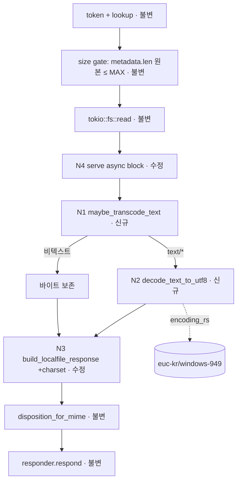

# Plan — browser-korean-text (feature lane)

> Source intent: `intent.browser-korean-text.md` (merged `(intent, human-confirmed)`, 2-round peer-reviewed).
> Scale: **feature** (scope 2, risk 2, ambiguity 1 → final 2). Stack: **Rust** (`src-tauri`).
> Planner ID: 48726-41263-1735. No interface skeletons (internal function changes, no new cross-boundary contract).

## 1. Goal

내장 브라우저가 `localfile://`로 로컬 텍스트 파일을 인라인 렌더할 때, 한글이 **UTF-8 및 한국어 레거시(EUC-KR/CP949)** 범위에서 깨짐 없이 표시되도록 한다.

## 2. Root cause

**코드 사실 (확정):** `localfile.rs`의 서빙 경로는 `classify_mime`(확장자 기반, charset 없음)가 만든 `text/plain`을 `Content-Type`에 그대로 싣고 **raw 바이트**를 `X-Content-Type-Options: nosniff`와 함께 전달한다. 실제 깨진 샘플(`어린왕자-dmsah10.txt`)은 **CP949**이며 UTF-8이 아님(첫 바이트 `bf a9 bc b8`).

**브라우저 결과 (추정):** charset 신호도 트랜스코딩도 없는 상태에서 WebKit가 파일과 불일치하는 기본/추정 인코딩으로 해석 → mojibake. (정확한 WebKit fallback 동작은 미검증 — 인텐트의 `[추정]` hedge 유지.)

**결론:** `; charset=utf-8`만 붙이는 것으로는 CP949 파일을 고칠 수 없다(바이트 자체가 UTF-8이 아니므로 디코딩/트랜스코딩이 필요).

## 3. Resolved strategy (인텐트 open questions 확정)

| 결정 항목 | 확정안 | 근거 |
|---|---|---|
| 전략 | **서버측 트랜스코딩**: text/* 바디를 UTF-8로 변환 후 `; charset=utf-8` 부여 | 커스텀 스킴에서 WebKit의 레거시 charset 준수에 의존하지 않아 결정론적. `dashboard/server.rs` 선례와 일관 |
| 감지 순서 | **strict UTF-8 우선 → 실패 시 CP949(EUC-KR)** | UTF-8 자기검증성으로 오판 위험 최소. 비한국어 레거시 미감지는 범위상 수용 |
| 적용 클래스 | **`text/*` 에만** 트랜스코딩+charset. 이미지/PDF/octet-stream은 바이트 보존 | 회귀 금지(비텍스트 attachment/inline 동작 불변) |
| MAX_BYTES | **원본 read-전 게이트 유지**(localfile.rs:566). 트랜스코딩 후 ≤~1.5x 팽창은 v1 수용. **단 N3 docstring precondition 갱신 필수**(아래 N3 참조) | 256MiB 텍스트는 비현실적. Content-Length는 트랜스코딩된 `bytes.len()`로 자연 정확. `LOCALFILE_MAX_BYTES`는 응답 바디 cap이 아니라 **원본 on-disk read cap**으로 의미를 명확히 함 |
| 의존성 | **`encoding_rs`만** 추가 (chardetng 불필요) | 일반 charset 추정을 하지 않음. WHATWG `euc-kr`/`windows-949` 디코더 제공, Firefox 인코딩 엔진 |

## 4. Pipeline decomposition



(canonical machine-readable DAG: `plan.mmd`.)

## 5. Node-by-node implementation notes

> 시그니처는 제안이며 구현자가 Rust 관용에 맞게 미세 조정 가능. 단, charset/클래스-게이팅/Content-Length 불변식은 유지할 것.

### N1 — `maybe_transcode_text` (신규, private fn) — **zero-copy 단축 포함**
- **목적:** MIME 클래스 게이팅 + UTF-8 happy-path 단축 + 레거시 분기.
- **동작 (claude2/claude3 수렴 — 공통 경로 full-buffer 복사 회귀 방지):**
  1. `!mime.starts_with("text/")` → `bytes` 원본 반환 (비텍스트 바이트 보존, **zero-copy**)
  2. `std::str::from_utf8(&bytes).is_ok()` → `bytes` 원본 반환 (이미 UTF-8/ASCII, **zero-copy**; UTF-8 BOM `EF BB BF`도 valid UTF-8이라 여기서 통과)
  3. 그 외(비-UTF-8 text/*) → `decode_text_to_utf8(&bytes).into_bytes()` (레거시 디코드 시에만 할당)
- **시그니처(제안):** `fn maybe_transcode_text(bytes: Vec<u8>, mime: &str) -> Vec<u8>`
  ```rust
  fn maybe_transcode_text(bytes: Vec<u8>, mime: &str) -> Vec<u8> {
      if !mime.starts_with("text/") { return bytes; }            // 비텍스트: 보존
      if std::str::from_utf8(&bytes).is_ok() { return bytes; }   // 이미 UTF-8: zero-copy
      decode_text_to_utf8(&bytes).into_bytes()                   // 레거시 CP949: 디코드
  }
  ```

### N2 — `decode_text_to_utf8` (신규, private fn in `localfile.rs`)
- **목적:** **비-UTF-8 레거시** 텍스트 바이트를 CP949로 디코드해 UTF-8 `String` 반환.
- **호출 조건:** N1의 3번 분기에서만(이미 UTF-8 실패가 확인된 바이트). 따라서 BOM 처리 불필요 — `decode_without_bom_handling` 사용으로 의도 명확화.
- **동작:** `encoding_rs::EUC_KR.decode_without_bom_handling(bytes).0.into_owned()` 반환. (`EUC_KR`은 windows-949/UHC = CP949 상위집합 → EUC-KR+CP949 단일 디코더로 커버.)
- **시그니처(제안):** `fn decode_text_to_utf8(bytes: &[u8]) -> String`
- **주의:** `had_errors`(`decode_without_bom_handling`은 2-tuple → **2번째 값** `.1`; `decode()`였다면 3번째)를 성공 판별자로 쓰지 말 것 — 비한국어 레거시(CP1252 등)가 had_errors=false로 *유효하지만 틀린* UHC 시퀀스를 만들 수 있음(§7 참조).

### N3 — `build_localfile_response` (수정, localfile.rs:265)
- **변경점:** `Content-Type` **헤더 값**만, `mime.starts_with("text/")`이면 `format!("{mime}; charset=utf-8")`, 아니면 `mime`. (charset은 상수 리터럴 — CR/LF 주입 없음.)
- **disposition은 원본 mime 유지 (codex3 — 방어적 future-proofing, 현 설계선 active bug 아님):** `disposition_for_mime`에는 charset 없는 **원본 `mime`**을 넘기고, charset은 별도 `content_type` 지역변수(헤더 전용)에만 붙인다. *현 설계(text/*에만 charset)에선 실제로 깨지지 않는다* — disposition은 `starts_with("text/")` prefix 매칭이라 charset 접미가 무해하고 `application/pdf`엔 애초에 charset이 안 붙음(localfile.rs:303 정확 비교는 안전). 다만 나중에 charset을 더 넓게 붙이는 변경에 대비한 belt-and-suspenders.
- **불변 유지:** Content-Length=`bytes.len()`(트랜스코딩된 버퍼), CSP, `nosniff`, Referrer-Policy.
- **docstring 갱신 필수 (codex2/codex3):**
  - Content-Type postcondition에 `text/*` → `; charset=utf-8` 반영.
  - precondition을 `bytes.len() <= LOCALFILE_MAX_BYTES`(하드)에서 → "원본 on-disk 파일이 read 전 size-gate를 통과했고, 트랜스코딩 후 응답 바디는 더 커질 수 있으며 Content-Length는 항상 최종 바디에서 산출"로 수정. `LOCALFILE_MAX_BYTES`는 응답 바디 cap이 아니라 원본 read cap임을 명시.

### N4 — serving async block (수정, localfile.rs:556–581)
- **변경점:** `let bytes = tokio::fs::read(...)` 직후, `build_localfile_response` 호출 전에:
  ```rust
  let bytes = maybe_transcode_text(bytes, &mime);
  let response = build_localfile_response(bytes, &mime, &canonical_path);
  ```
- **불변 유지:** size gate(566)는 원본 `metadata.len()` 기준 그대로. 에러 경로(404/413/500) 불변.

### Cargo.toml (수정)
- `encoding_rs = "0.8"` 추가 (일반 semver; 정확 버전은 `Cargo.lock`이 pin).

## 6. Validation & test plan

**컴파일/타입 (루트에 Cargo.toml 없음 — 반드시 manifest 경로 지정):**
```bash
cargo check --manifest-path src-tauri/Cargo.toml
cargo test  --manifest-path src-tauri/Cargo.toml commands::localfile
```
(워크트리 플래너 단계에선 스켈레톤이 없어 Phase 6는 헤더+Mermaid 스모크; 실제 컴파일/테스트 검증은 구현자 Phase에서.)

**단위 테스트** (`#[cfg(test)]` in `localfile.rs`, **커밋된 인라인 바이트 벡터** — `~/Downloads` 의존 금지):
- `decode_text_to_utf8` (**CP949 전용** — N1이 비-UTF-8 확인 후에만 호출):
  - CP949 `[0xbf,0xa9,0xbc,0xb8]` → `"여섯"` (샘플 도입부 바이트)
  - (선택) ASCII `b"hello"` → `"hello"` — CP949의 ASCII 상위호환 문서화용일 때만
  - ⚠ **UTF-8 한글 패스스루 케이스는 여기 두지 말 것** — UTF-8 `"안녕"` 바이트(`ec 95 88 eb 85 95`)를 CP949로 디코드하면 깨진다(검증됨). 그 케이스는 N1 소관
- `maybe_transcode_text` (**zero-copy 단축이 사는 곳** — UTF-8/ASCII 패스스루 검증 위치):
  - `("text/plain", "안녕".as_bytes())` → **바이트 동일**(유효 UTF-8 zero-copy 패스스루)
  - `("text/plain", b"hello")` → **바이트 동일**(ASCII 패스스루)
  - `("text/plain", CP949 [0xbf,0xa9,0xbc,0xb8])` → UTF-8 "여섯" 바이트로 변환됨
  - `("image/png", &[0x89,0x50,0x4e,0x47,...])` → **바이트 동일**(비텍스트 보존)
- `build_localfile_response`:
  - `text/plain` → `Content-Type: text/plain; charset=utf-8`, `Content-Length == bytes.len()`
  - `image/png` → `Content-Type: image/png` (charset 없음)
  - 기존 보안 헤더(CSP/nosniff/referrer) 존재 유지

**비회귀:** 기존 `disposition_for_mime` 테스트(인라인 클래스/control-char sanitize) 불변. ASCII/영문 텍스트, 이미지/PDF, attachment 동작 변화 없음.

**수동 검증:** `어린왕자-dmsah10.txt`(CP949)를 내장 브라우저로 열어 "여섯 살 적에 나는 「체험한 이야기」…" 정상 표시 확인; UTF-8 한글 `.txt`/`.md`도 정상.

## 7. Risks & mitigations

- **⚠ 비한국어 비-UTF-8 텍스트의 능동적 회귀 (claude2/claude3 수렴, v1 한계로 수용)** —
  "strict UTF-8 → else CP949" 분기는 **무조건적**이라, valid UTF-8이 아닌 모든 `text/*`를
  한글(UHC)로 강제 디코드한다. 따라서 **Windows-1252/Latin-1 서양 텍스트**(스마트따옴표
  `0x92`, 악센트 문자)나 **Shift_JIS 일본어** `.txt`/`.csv`/`.md`는 현 상태(WebKit 추정)보다
  **악화**되어 서버가 결정론적으로 mojibake/U+FFFD로 망가뜨린다. 서양 CP1252 케이스는
  주변부가 아니라 흔한 경우다.
  - **결정: option (a) — v1 한계로 명시적 수용** (한국어 우선 도구). 단순하고 정직.
  - `had_errors` 게이트(option b)는 **함정**: CP1252 상위 바이트가 had_errors=false로
    *유효하지만 틀린* UHC 시퀀스를 만들어 조용히 망가뜨림 → 거짓 안전감만 줌. 미채택.
  - 더 넓은 정확성이 필요하면 `chardetng`(§3에서 제외)가 유일한 실제 경로 — 이번 범위 밖.
- **신규 의존성(`encoding_rs`)** — 빌드 시간 소폭 증가. 완화: 광범위 사용/검증된 crate(Firefox 엔진).
- **text/* 확장자를 가진 바이너리** — 디코드 시 치환문자 발생 가능. 범위상 수용(확장자 기반; 바이너리 위장 감지는 out-of-scope).
- **CP949 의도였으나 우연히 valid UTF-8인 파일** — UTF-8로 유지(정상; valid UTF-8은 모호하지 않음).
- **MAX_BYTES ~1.5x 팽창** — 256MiB 경계 텍스트에서만 이론적 초과. v1 수용(원본 read cap로 의미 재정의, N3 docstring 갱신). 필요 시 post-transcode 413 체크는 후속.
- **(비결정 기록, v1 범위 밖 — claude3)** `maybe_transcode_text`의 동기 CPU 디코드는 spawn된 async 블록(localfile.rs:556+) 안에서 실행되어, MAX_BYTES 근처 레거시 파일에서 async 워커 스레드를 잠깐(~sub-second) 블록한다. v1(사용자 단발 조회, 낮은 동시성)에선 수용. 문제가 되면 레거시 분기에 `spawn_blocking` 적용이 레버 — 의식적 비결정으로 기록.

## 8. Out-of-scope (구현자 금지)

터미널/캔버스/협업 패널, 원격 http(s) charset, 한국어 외 인코딩(UTF-16/32·Shift_JIS·GBK·Big5), 에디터 변환 기능, attachment→inline 동작 변경, 보안 헤더/토큰/deny-prefix/URL-scheme 3-way invariant 변경.

## 9. Self-verification (feature lane rubric, 4×4)

| 기준 | 점수(4) | 비고 |
|---|---|---|
| 목표 정합성 (intent↔plan) | 4 | goal/scope/success 모두 추적 |
| 분해 완전성 (E2E 노드 누락 없음) | 4 | read→transcode→build→respond 전 구간 |
| 제약/불변식 보존 | 4 | 보안 헤더·MAX_BYTES·Content-Length·클래스 게이팅 명시 |
| 검증 가능성 (테스트/수동) | 4 | 인라인 바이트 fixture + 수동 시나리오 |

(스켈레톤 미발행 → "Docstring quality"/"Interface cohesion" 기준 제외.)
